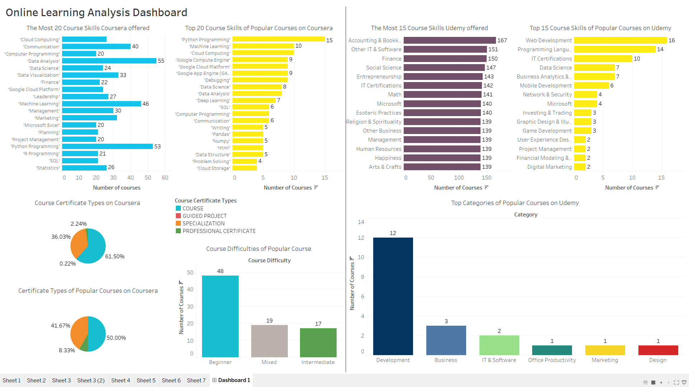

# Online Learning Platform Analysis Project

<u>**Objective** : Exploratory Data Analysis of courses and popular courses on Coursera and Udemy Platform</u>

*for non-profit purpose*

Processes : Data Cleaning, EDA, and Visualization

*by Patcharanat P.*

**Dataset : Provided by Kaggle**

---

Coursera Courses - *by Sowmya lyer*
* ['Coursera_catalog.csv'](https://www.kaggle.com/sowmyaiyer/coursera-courses-and-details)

Udemy Courses - *by Keliza Toh*
* ['Udemy_Raw.csv'](https://www.kaggle.com/kelizatoh/udemy-courses)

### Table of Contents
---
* Import Library
* Data Cleaning
* Exploratory Data Analysis and Data Visualization
    * Coursera Analysis
    * Udemy Analysis

-- See more details in "online-learning-platform-analysis.ipynb"

# Tableau Dashboard

[View in Tableau Public](https://public.tableau.com/views/online-learning-analysis-dashboard/Dashboard1?:language=en-US&:display_count=n&:origin=viz_share_link)

